## 寻访红色印记，传承红色基因丨参观一江山岛登陆战纪念馆

 

1月8日上午，2020浙江公安入警训练（台州）班全体学员在台州警校老师的带领下前往一江山岛登陆战纪念馆参观学习，寻访红色印记。在展览馆里听历史，学党史，一睹先烈的风采，重温那段光辉的革命岁月。

 

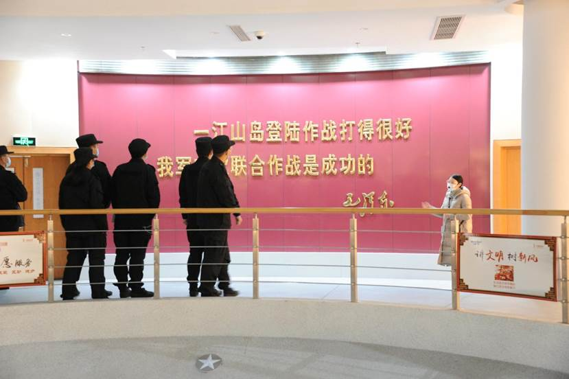

新警学员参观了各个展厅，通过详实的图片和文字资料详细了解了一江山岛解放战役的历史和战斗经过，以及大陈岛的解放和战后重建工作。

 

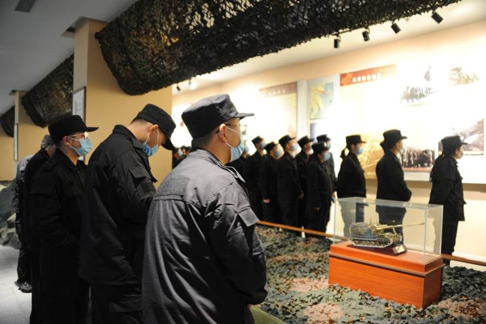

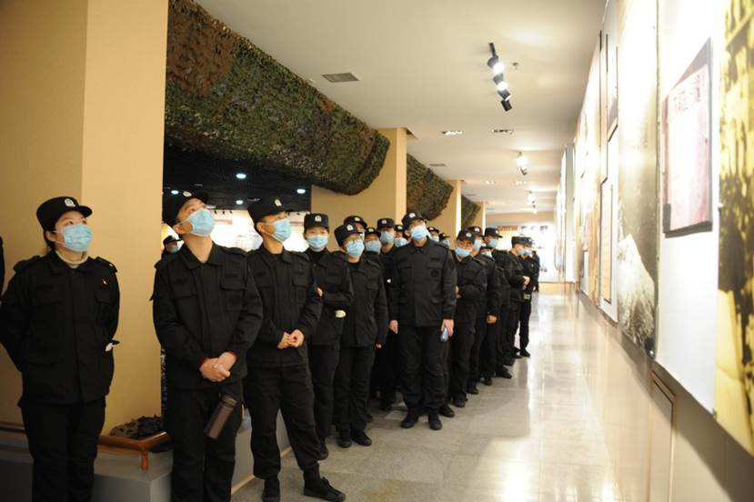

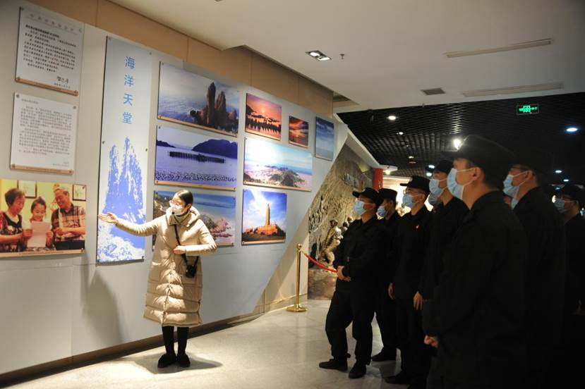

纪念馆讲解员为新警学员进行了详实的介绍，“一江山岛登陆战纪念馆所铭记的英勇事迹发生在1955年1月18日。当时，大陆解放，国民党政权退居台湾，但是浙东以及台州国民党残余军队尚占踞台州湾口外的大陈岛、一江山岛等岛屿，并不断骚扰大陆沿海地区。为了全部解放浙江沿海岛屿，保障经济建设和沿海人民的安居乐业，中共中央军委决定一举解放一江山岛。于是，在华东军区参谋长张爱萍的统一指挥下，华东军区部队发起了进攻一江山岛的战役。这次战役是人民解放军首次陆、海、空三军的协同作战，共击毙敌人567人，俘虏519人。此次战役的规模虽然不大，但是影响深远，被称为中国的“诺曼底”登陆战。它是我军第一次十分成功的陆、海、空三军联合渡海登陆作战，取得了非常宝贵的协同登陆作战经验，为全部解放浙江沿海岛屿打响了胜利的第一炮。同时，一江山岛登陆战还表明了人民解放军实行现代化战争的作战能力大大提高，标志着我军现代化作战形式的发展和战斗力的提升，是我军战争史上具有划时代意义的里程碑。”

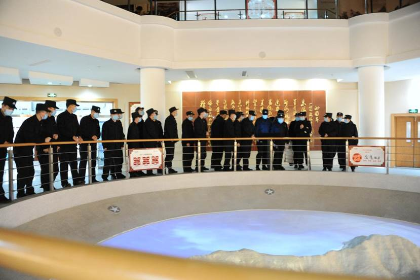

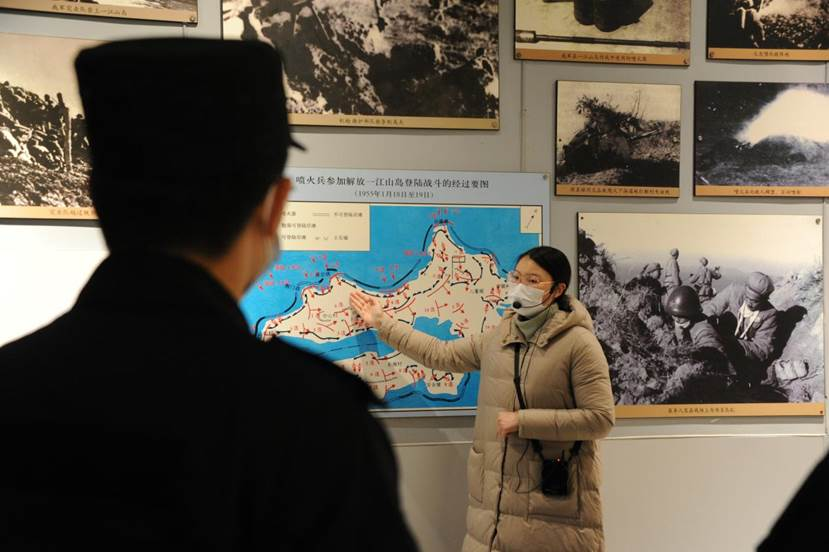

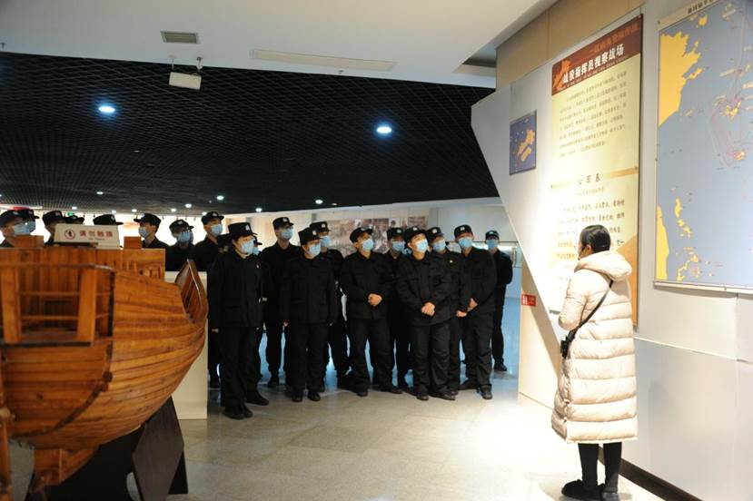

 

在二楼展厅，新警学员细致观察一江山岛战役中使用的物品、烈士遗物和参战老同志捐赠的物品，同时也被张爱萍将军的一首荡气回肠《沁园春》所震撼——

 

 **东海风光，廖廓蓝天，滔滔碧浪。看骑鲸蹈海，风驰虎跃，雄鹰猎猎，雷击龙翔。雄师易统，戎机难觅，陆海空直捣金汤，锐难当。望大陈列岛，火海汪洋。**

**料得帅骇军慌，凭一纸空文岂能防。忆昔诺曼底，西西里岛，冲绳大战，何须鼓簧。陡崖峭壁，钢铁堡垒，首战奏凯震八荒。英雄赞，似西湖竞渡，初试锋芒。**

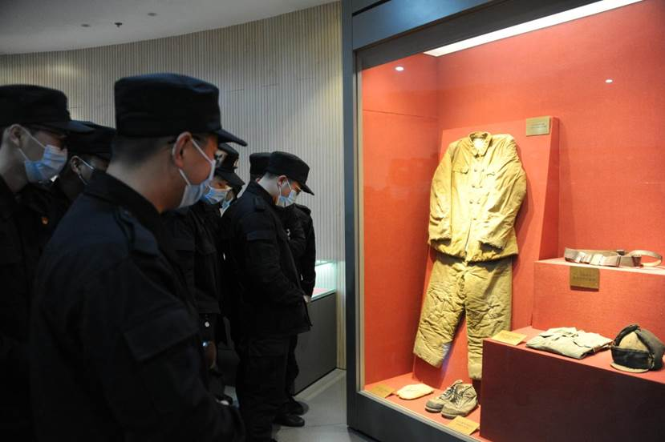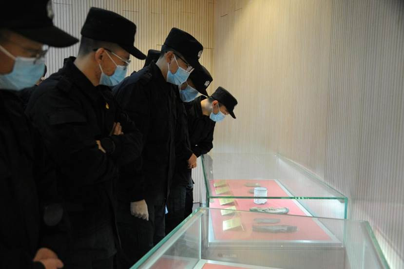
 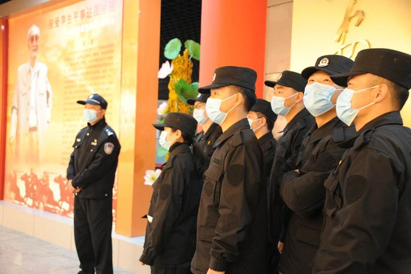

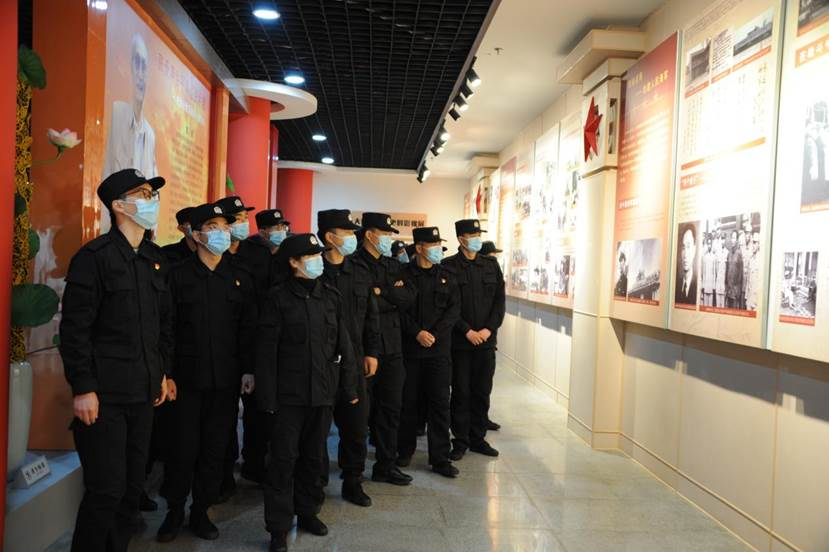
 从纪念馆出来，新警学员们对“不怕艰险、智勇坚定、团结奋斗、不胜不休”的一江山岛精神有了更为深刻的理解，纷纷表示通过传承红色基因，更好地缅怀革命先烈。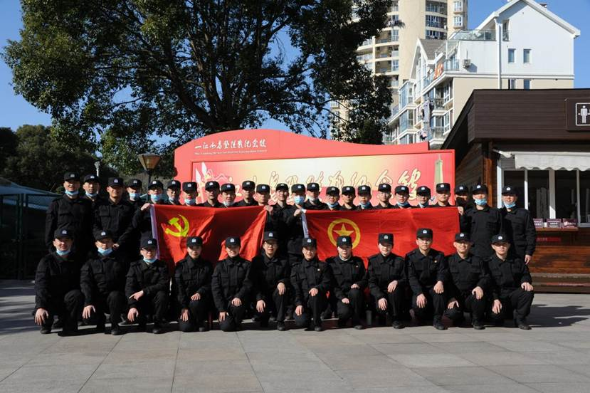

 

 

 

 